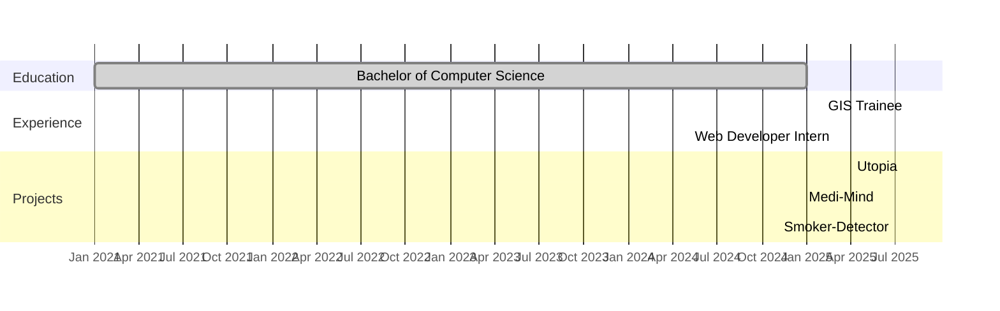

# Ayon Ghosh

**Aspiring Software Engineer & Tech Enthusiast**

  
  
  
  

---

## 👨‍💻 About Me

I am a self-driven software engineer with a passion for building scalable, user-friendly applications and effective algorithms. My experience spans web development, GIS data management, and embedded systems. I thrive on solving real-world challenges using modern technologies.

* 🌱 Currently deepening my knowledge in **Advanced React**, **System Design**, and **Cloud Services**.
* 💬 Open to discussing **C++**, **Python**, **Django**, **Java**, **GIS**, and **Embedded Systems**.

---

## 🛠 Skills

* **Languages:** C++, Java, Python, JavaScript, Kotlin
* **Web & Backend:** Django, Flask, Node.js (Express), ReactJS, Next.js
* **Databases:** MongoDB, MySQL, PostgreSQL
* **DevOps & Hosting:** Docker, GitHub Actions, Render, Vercel
* **GIS & CAD:** ArcGIS, QGIS, AutoCAD, PostGIS
* **Mobile & Embedded:** Android Studio, Arduino
* **Others:** Git, Linux, RESTful APIs, CI/CD, Agile Methodologies

<!-- Skill Proficiency Bars -->

## 📊 Skill Proficiency

I've visualized proficiency for key skills using shields.io badges, which reliably render on GitHub:

* **C++**
  

* **Python**
  

* **Java**
  

* **JavaScript**
  

* **Django**
  

---

## 💼 Work Experience

**Web Developer Intern** @ Eutropia IT
*Mar 2025 – Jun 2025*

* Developed responsive web applications with **React**, **Next.js**, and **Node.js**, integrating pre-trained AI models for enhanced UX.
* Architected RESTful APIs using Express and MySQL; implemented authentication with JWT & OAuth2.
* Automated CI/CD pipelines using GitHub Actions and deployed to Render & Vercel.

**GIS Trainee** @ Dhaka WASA
*Feb 2025 – Mar 2025*

* Updated and digitized spatial data for water supply networks using **ArcGIS**, **QGIS**, and **AutoCAD**.
* Conducted GPS-based field surveys and integrated customer data into PostGIS for accurate mapping.

---

## 🎓 Education

**Bachelor of Computer Science**
University of Asia Pacific, Dhaka  *(2021 – 2025)*

* CGPA: 3.50
* Coursework: Data Structures & Algorithms, Databases, Operating Systems, Networks, Machine Learning, Software Engineering, Embedded Systems.

---

## 🚀 Projects

### Utopia – Country Management System

* **Tech:** Django, PostgreSQL, Stripe API, Bootstrap
* Modules for voting, healthcare facility management, transport, and entertainment.
* Integrated secure payment gateway and role-based access control.

### Smoker-Detector – Smoking Status Predictor

* **Tech:** Flask, Scikit-Learn, HTML/CSS, Bootstrap
* Predicts smoking status based on 27 user inputs with an accuracy of \~80%.
* Intuitive form-based UI and result visualization.

### Medi-Mind – AI Healthcare Platform

* **Tech:** MERN Stack, TensorFlow
* Features disease detection via image upload, doctor recommendation engine, appointment booking, and payment integration.

### Stock Manager – Market Data Dashboard

* **Tech:** React, Django REST Framework, PostgreSQL, Chart.js
* Real-time CRUD operations, interactive stock trend visualizations, and user authentication.

---

## 🕒 Career Timeline

---

## 📈 GitHub Stats

  
  

## 📊 Contribution Heatmap

  

---

## 📫 Connect with Me

  
  

---

## 📫 Connect with Me

  
  
  
  

